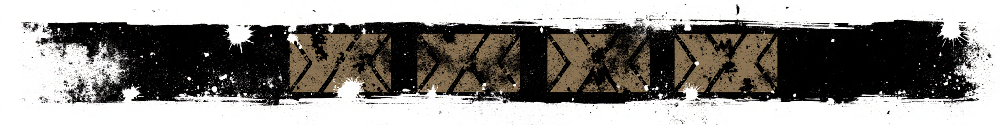
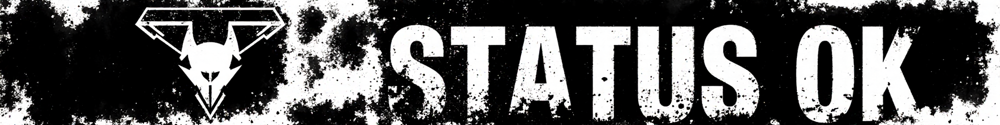
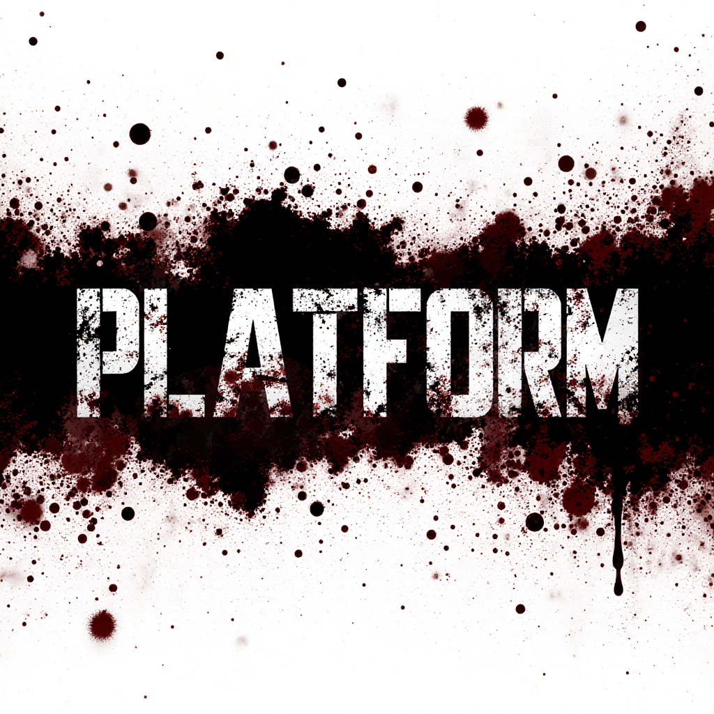
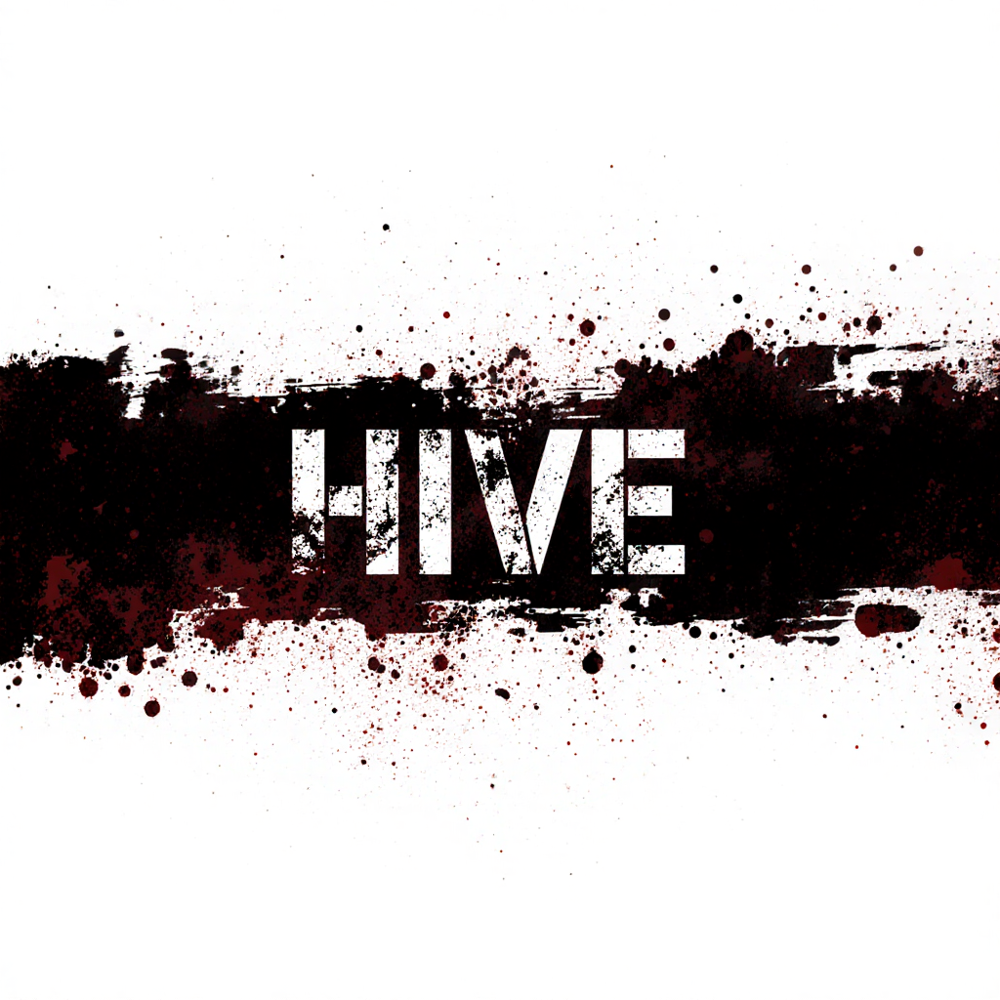
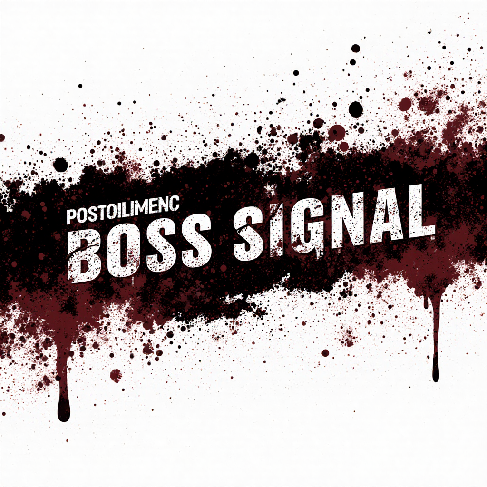
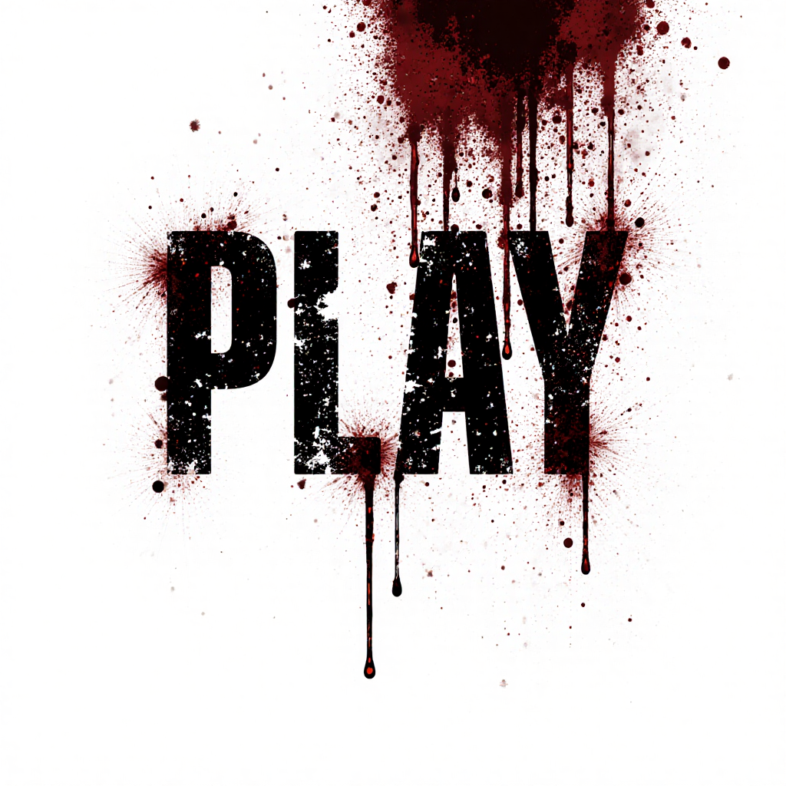
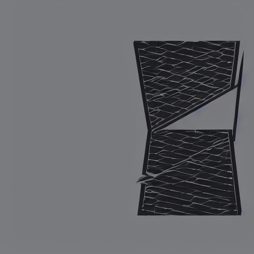

<h1 align="center">
  DAYZ: COMMAND CENTER
</h1>

<strong><em>SURVIVE. CONSOLIDATE. DOMINATE.</em></strong> 
<em>A consolidated workspace for DayZ-related operations: platform tooling, prototype mods, backend services, dashboards, and ecosystem research.</em>

## 🗺️ TACTICAL LAYOUT

The repository is structured to maintain maximum operational efficiency and survivability across the DayZ modding ecosystem:

- `platform/` - Operations and intelligence platform (KB, intel, config management, CLI tactical tools)
- `mods/` - DayZ Enforce Script payload (HiveApiMod, BossSignal, TrophyHunter, marks-content)
- `backends/` - Service backends (HiveAPI, BossSignal-backend)
- `frontends/` - Web UIs, dashboards, and command interfaces
- `build-pipeline/` - Shared orchestration tooling (FileBank + DSSignFile automation)
- `research/` - Field notes, tactical exploration, ecosystem analysis
- `docs/` - Architecture schematics, runbooks, and critical decision logs
- `planning/` - Session planning, handoff briefings, and mission roadmap
- `tools-extra/` - Ad-hoc scripts pending promotion to `platform/tools`

> **INTEL:** Review `platform/ARCHITECTURE.md` for complete layer relationships, and `ROADMAP.md` for upcoming operations.

## CURRENT REALITY

This repository mixes working services, prototypes, and historical planning notes. The most accurate status is:

| Area | Current state |
|---|---|
| BossSignal backend + dashboard | Working local FastAPI service on `:6700`; ingests events, stores boss/trophy data, serves the React dashboard, and streams SSE. Some dashboard panels still use demo/mock fallback data when no live rows exist. |
| `mods/BossSignal` | Telemetry mod. It registers boss classes and emits startup, heartbeat, kill, synthetic, and API-driven spawn/despawn/custom events. It does not include boss gameplay content. |
| External boss-content mod | The demo stack expects a third-party Steam Workshop boss mod to supply the actual boss zombie classes. You supply your own; none is included or referenced by name in this repo. |
| `mods/TrophyHunter` | Prototype trophy-award mod. Backend routes and mod-side award helpers exist, but the end-to-end in-game trophy flow still depends on first-play validation and reliable BossSignal participant/top-damager data. |
| `backends/hiveapi` | Working backend route scaffold for server login, character claim/heartbeat, inventory apply/set, admin events, and server bootstrap. |
| `mods/HiveApiMod` | Integration scaffold. Login, claim, heartbeat, and inventory request helpers exist, but Bearer token use, character-id handoff, restore, autosave, disconnect save, and kill/death handling are not production-ready. |
| `tools-extra/modctl` | Working local CLI for doctor/build/deploy/ship/dev-loop helpers. `ship` is build + deploy; release/catalog/shop workflows are design notes, not implemented. |
| `platform/` | Working KB/intel/config layers plus early operator CLI tools. |

## 🏗️ ARCHITECTURE SCHEMATIC

Five strategic layers, built from the bottom up: **Knowledge Base, Intel, Config, Tools, and Play.**

## 📡 OPERATIONAL STREAMS

| | Stream | Objective |
|---|---|---|
|  | **PLATFORM** | Core tooling and shared infrastructure for cross-mod deployment. |
|  | **HIVE** | Centralized backend and persistent player/server telemetry. |
|  | **BOSS SIGNAL** | Real-time mod runtime and event/signal pipeline network. |
|  | **PLAY** | Direct in-game survival experience, asset integration, and content delivery. |

## 🩸 ORIGIN & CONSOLIDATION

This base of operations was fully consolidated on **2026-04-26** from two former outposts:
- `dayzAPI` - Legacy modding operations, build pipelines, and HiveAPI backend.
- `dayz-stack` - Operational and intel platforms.

Both predecessors have since been folded into this repository; their code now lives under `platform/`, `backends/`, and `mods/`.
